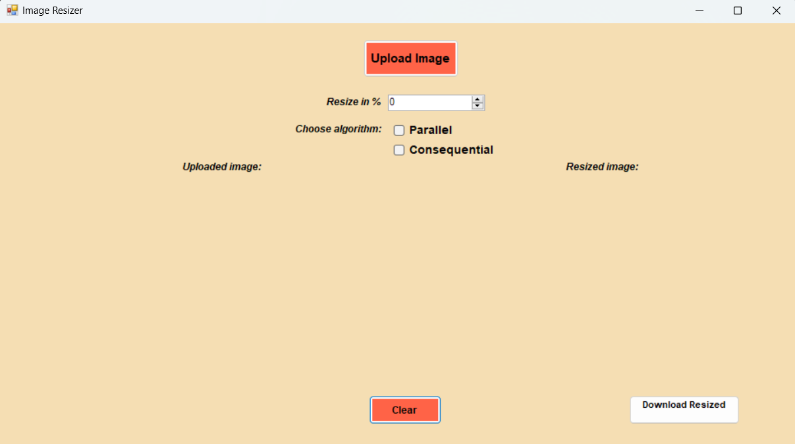
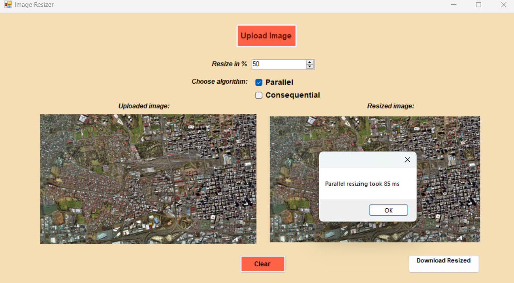
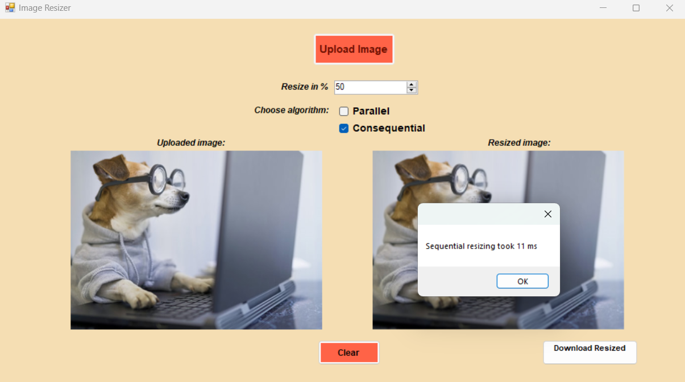

# ImageResizer WinForms Application 📸

## Overview 🌟
The ImageResizer is a custom WinForms application designed for image downscaling. It enables users to select an image, specify a downscaling factor as a percentage of the original size, choose from two available downscaling algorithms, and effortlessly generate a new, downscaled image.

## Features 🚀
- **Select Image**: Choose an image file. 📁
- **Input Downscaling Factor**: Enter a percentage to scale down the original image. 🔢
- **Downscaling Algorithms**: Choose from the two implemented downscaling algorithms - consequential and parallel.
- **Downscale Image**: Generates a downscaled version of the selected image. 🖼️
- **Download Resized Image**: Option to download the resized image to the local machine. 💾

## Getting Started 🚀
1. **Clone or download** the repository to your local machine.
2. Open the `.sln` file with **Visual Studio**.
3. **Run** the application. :running:

## Screenshots 📸
Here's a look at our application in action:

Screenshots of two different scenarios with test images:

